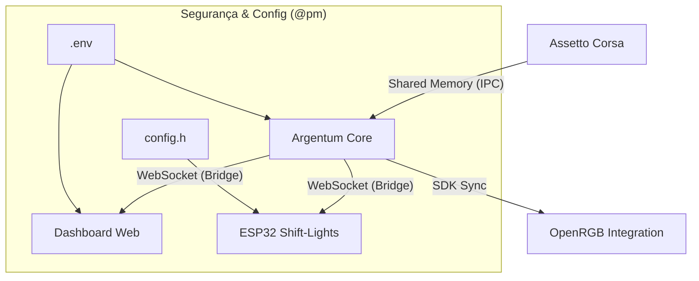

# 🏎️ Project Silver Arrow: Telemetry Bridge

**Project Silver Arrow** é um ecossistema de telemetria de alta performance projetado para transitar do **SimRacing** (Assetto Corsa) para o **Mundo Real** (OBD-II/CAN Bus). O sistema foca em baixa latência (<10ms), modularidade e aprendizado autodidata de engenharia de software e hardware.

---

## 🏛️ Arquitetura: Argentum Core

O coração do projeto é o **Argentum**, um orquestrador em Python que utiliza comunicação entre processos (IPC) via [Shared Memory](docs/argentum_memory_mappings.md) para extrair dados brutos do simulador com overhead quase nulo.

### 📊 Fluxo de Dados (High-Level)



### 🚀 Principais Funcionalidades
- **Telemetria de Baixa Latência:** Extração em tempo real via [Shared Memory IPC](docs/argentum_memory_mappings.md).
- **Arquitetura Bridge:** Distribuição de dados via WebSockets JSON.
- **Mascote Argentum Buddy:** Feedback visual no terminal de comando.
- **Ecossistema OpenRGB:** Sincronismo com hardware de PC via SDK.

---

## 📂 Estrutura do Repositório

```text
├── dashboard_web/      # Interface web em Next.js para análise de dados
├── docs/               # Logs de engenharia, mapas de memória e estudos
├── firmware_esp32/     # Código C++/Arduino para Shift-Lights (ESP32)
├── open_RGB/           # Integração com o ecossistema OpenRGB
├── scripts_python/     # Argentum Bridge e Orquestrador
├── .env.example        # Template de variáveis de ambiente (Segurança)
└── .gitignore          # Proteção contra binários e segredos
```

---

1. **Instalação de Dependências:**
   ```bash
   pip install -r scripts_python/requirements.txt
   pip install -r open_RGB/requirements.txt
   ```

2. **Configuração de Segurança (.env):**
   - Copie o arquivo `.env.example` para um novo arquivo chamado `.env`.
   - Configure seus SSIDs, IPs e caminhos de hardware no `.env`.
   ```bash
   cp .env.example .env
   ```

3. **Configuração do ESP32:**
   - Acesse `firmware_esp32/argentum_esp32_client/`.
   - Copie `config.h.example` para `config.h` e insira suas credenciais de WiFi.

4. **Execução:**
   ```bash
   # Inicie a Bridge (Back-End)
   python scripts_python/argentum_bridge.py
   
   # Em outro terminal, caso use luzes RGB:
   python open_RGB/ac_rgb_integration.py
   ```

---

## 🏁 Roadmap de Evolução

- [x] **Fase 1:** Extração via Shared Memory do Assetto Corsa.
- [x] **Fase 2:** Integração com ESP32 via WebSocket para Shift-Lights.
- [x] **Fase 3:** Dashboards Web em tempo real (Next.js).
- [ ] **Fase 4:** Conexão OBD-II/CAN Bus em veículos reais.

---

## 🛡️ Licença

Este projeto está sob a licença **GNU General Public License v3**. Veja o arquivo [LICENSE](LICENSE) para detalhes.

## 👥 Contribuição e Mentoria
Desenvolvido por **Hermes071** com mentoria da equipe agêntica **Project Silver Arrow**.
